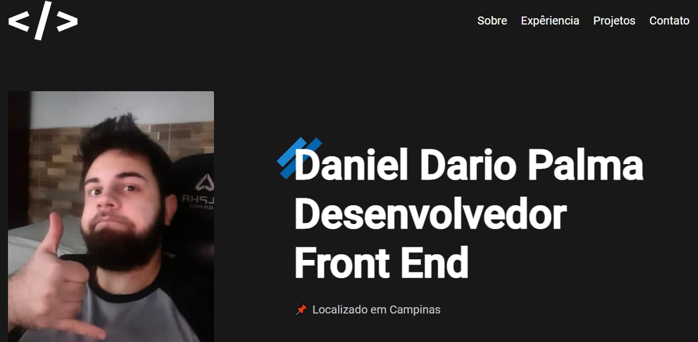

# Portfólio Daniel Dario Palma

</img>

## Projeto

Este projeto serve como um portfólio meu.

Para acessar o site, basta [clicar aqui](https://danieldpalma.github.io/portfolio/)

## Objetivo

O objetivo deste projeto é testar minhas habilidades com HTML e CSS, e servir como portfólio para me ajudar a conseguir minha primeira oportunidade como Desenvolvedor Web.

## Tecnologias

- HTML
- CSS
- Javascript

## Pacotes e tecnologias de terceiros

Também foram utilizados:

- [FormSubmit](https://formsubmit.co/)
- [Cleancss](https://www.npmjs.com/package/clean-css-cli)

### Status: Em andamento
